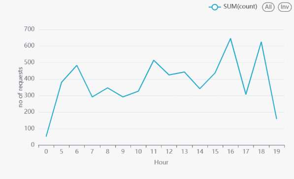
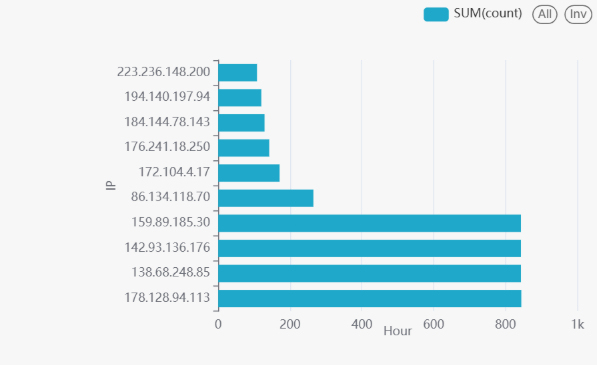
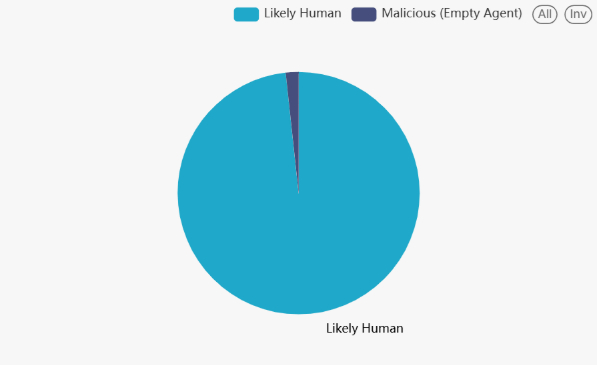
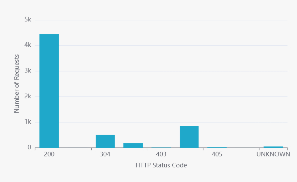

# Automated Nginx Log Analytics Pipeline
### End-to-End Medallion Data Lakehouse with PySpark & Python

This project implements an **event-driven data engineering pipeline** that monitors, parses, and analyzes **Nginx web server logs in real time**.  
Using a **Medallion Architecture (Bronze → Silver → Gold)**, raw unstructured logs are transformed into **high-value, analytics-ready datasets** stored in optimized **Apache Parquet** format.

---

## Architecture Overview

The pipeline follows a **four-stage lifecycle**:

###  Bronze – Event-Driven Ingestion
- Python **Watchdog** monitors the landing zone
- Automatically triggers processing when a new `.log` file is detected
- It automatically triggers the pipeline for existing log files at the start of execution.

###  Silver – Schema Enforcement
- Parses raw logs using **Regex** with PySpark
- Converts timestamps into Spark-native formats
- Writes **Snappy-compressed Parquet**, reducing storage by up to **60%**

###  Gold – Analytical Modeling
- Bot vs Human traffic classification
- Hourly traffic aggregation
- HTTP status code analysis
- Pre-aggregated, BI-optimized datasets

###  Business Intelligence
- Gold layer optimized for **sub-second queries**
- Compatible with:
  - Apache Superset
  - Power BI
  - Looker Studio
- Superset connects directly to the **Gold layer Parquet file**

### Dashboards & Metrics

The following analytical datasets are visualized in Superset:

**Hourly Traffic (hourly_traffic)**
Displays request volume per hour to identify peak usage times and traffic patterns.


**Error Analysis (error_analysis)**
Tracks 4xx and 5xx HTTP status codes to monitor application and server health.

**Top Visitors (top_visitors)**
Identifies the most frequent client IPs accessing the server.


**Bot vs Human Traffic (bot_vs_human)**
Classifies requests based on User-Agent patterns to detect bots and automated traffic.


**Response Code Distribution (response_code_distribution)**
Visualizes the proportion of HTTP response codes across all requests.


---

## Tech Stack

- **Language:** Python 3.x  
- **Processing Engine:** Apache Spark (PySpark)  
- **Orchestration:** Python Watchdog (event-driven)  
- **Storage Format:** Apache Parquet  
- **Compression:** Snappy  
- **Data Analysis:** Pandas  
- **Visualization:** Apache Superset  

---

## Key Analytics & Insights

- **Hourly Traffic (`hourly_traffic`)**
- **Error Analysis (4xx / 5xx) (`error_analysis`)**
- **Top Visitors by IP (`top_visitors`)**
- **Bot vs Human Traffic (`bot_vs_human`)**
- **HTTP Response Code Distribution (`response_code_distribution`)**
- **Top Bandwidth-Consuming URLs (`top_bandwidth_urls`)**

---

##  How to Run the Pipeline

###  Start the Orchestrator
```bash
python main.py
